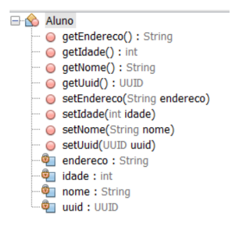

# CBTLPR2_TP_02

<ol>
  <li>Desenvolver o seguinte sistema abaixo, empregando os conhecimentos adquiridos nas aulas sobre interfaces gráficas em java.</li>
  <ol>
    <li type="a">Criar a seguinte classe Aluno, conforme diagrama:</li>
     
    
     
    Dica: Pesquisar a classe UUID.
      
    <li type="a">Implementar o formulário possibilitando ao usuário cadastrar uma lista de alunos, respeitando as seguintes regras:</li>
    <ol>
      <li type="i">Quando o botão Ok for pressionado os dados contidos em tela devem ser armazenados em memória (utilizar a interface List <E> em conjunto com a classe ArrayList<E> para armazenar a lista de alunos cadastrados em memória)</li>
        <li type="i">Limpar apaga o conteúdo dos labels.</li>
        <li type="i">Botão Mostrar exibe o pop-up a ser desenvolvido no item (C) deste trabalho.</li>
        <li type="i">Botão Sair encerra a aplicação.</li>
    </ol>
     
    <li type="a">Criar o mecanismo de exibição abaixo, que contempla todos os ids e nomes dos alunos cadastrados nesta execução do programa, utilizando a classe: JOptionPane.showMessageDialog(this, mensagem);</li>
  </ol>
</ol>
 
Desenvolvido por Beatriz Bastos Borges e Miguel Luizatto Alves
